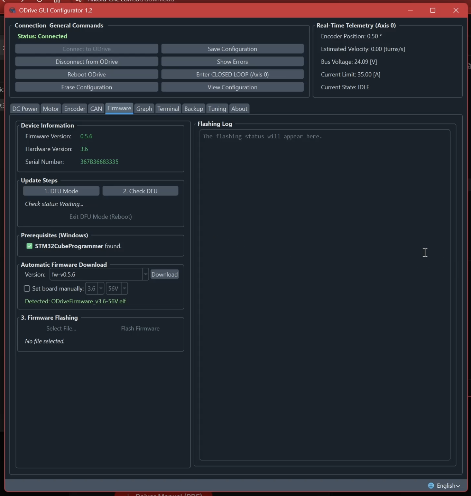
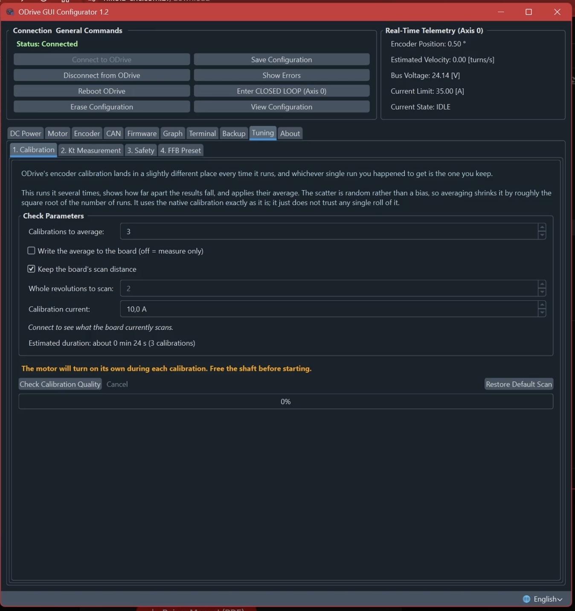
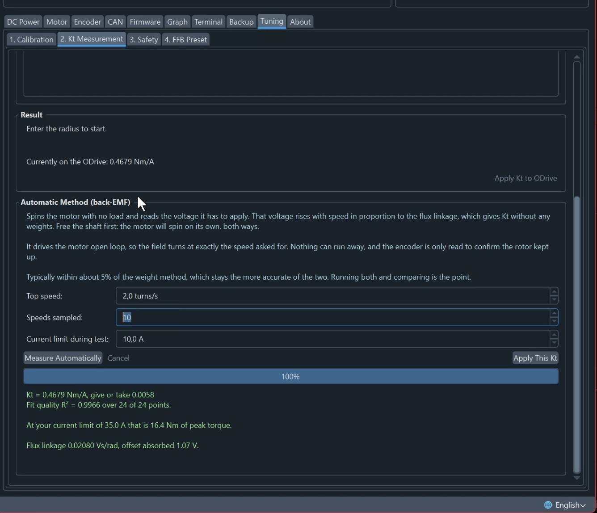
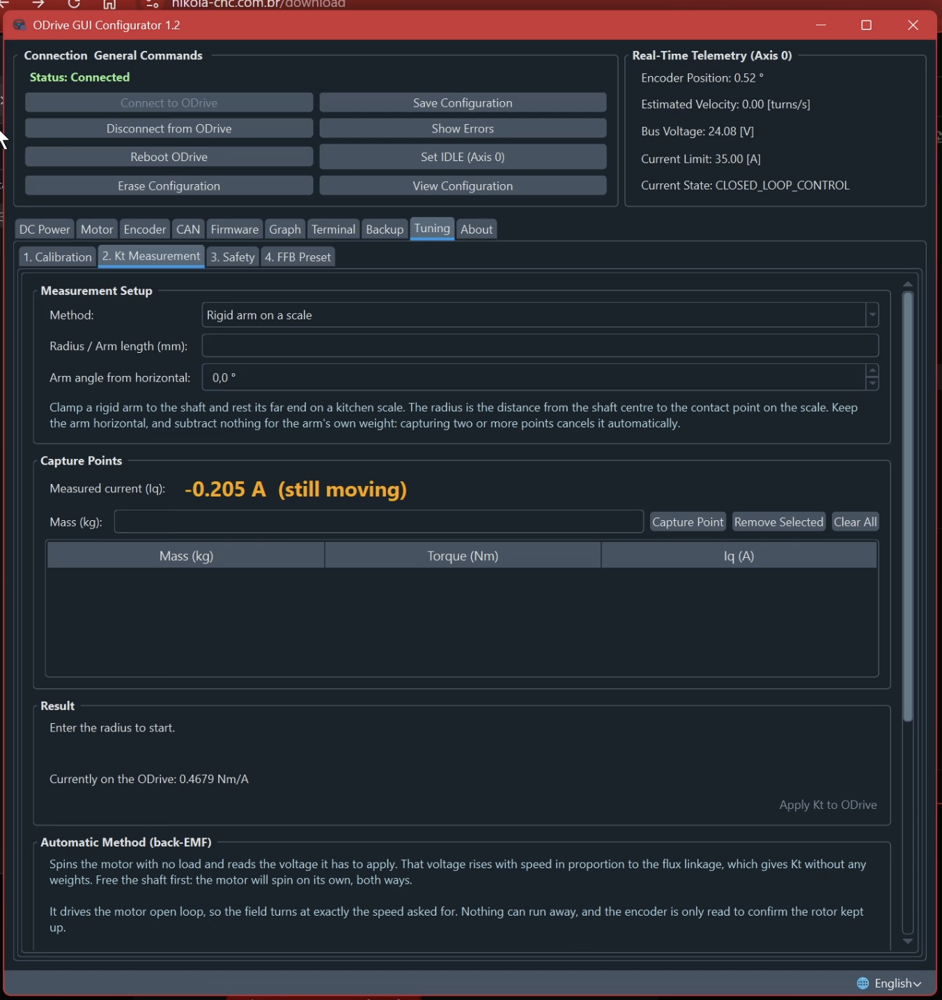
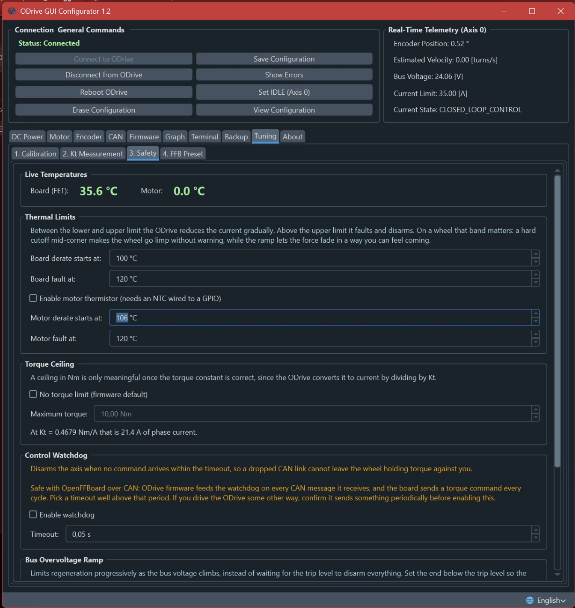
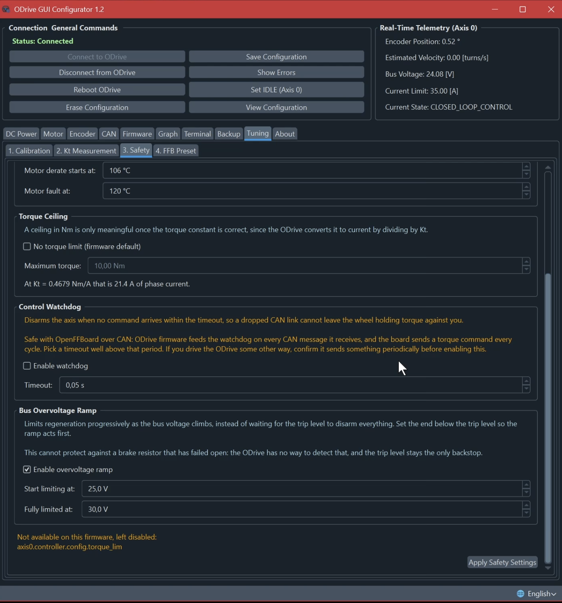
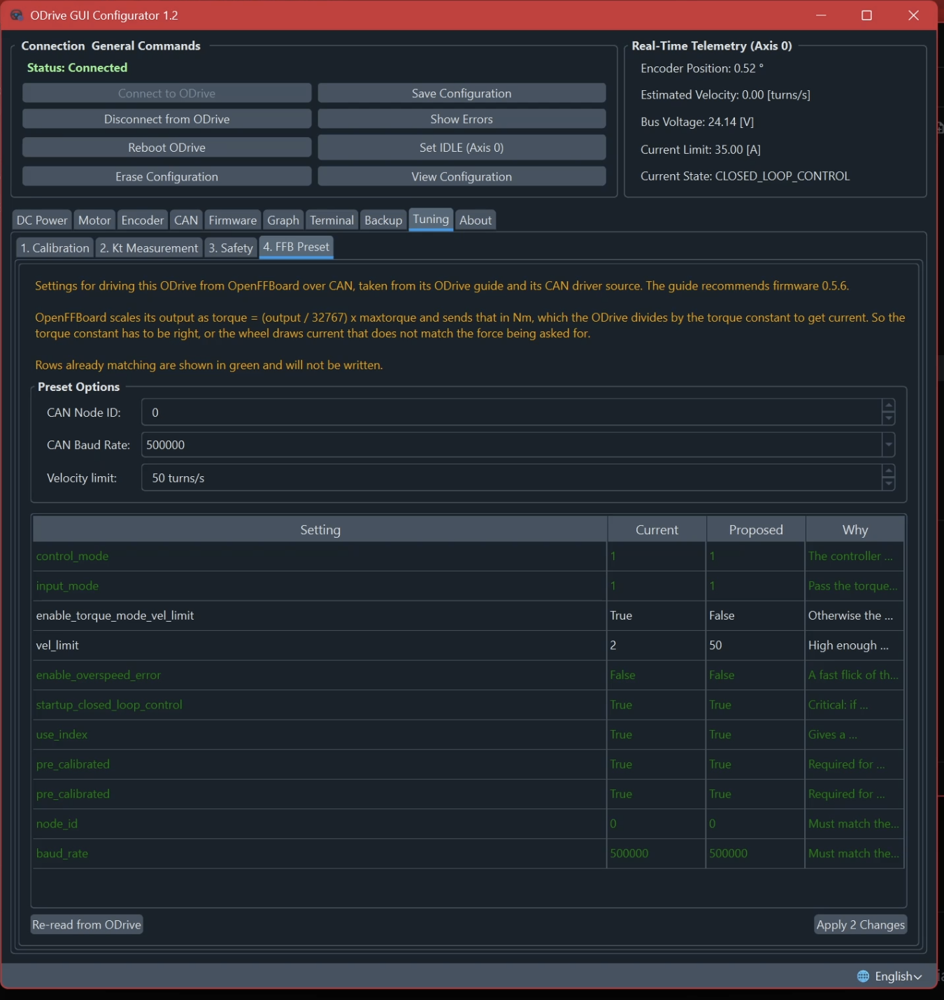

# Funcionalidades adicionadas

Ferramentas para volante **direct drive** com **OpenFFBoard**, acrescentadas ao
`odrive-gui-configurator` original de Marcos Silva. Nada do comportamento original foi
alterado — tudo aqui é adicional.

Para o **procedimento** (em que ordem usar), veja [GUIA-AJUSTE-FFB.md](GUIA-AJUSTE-FFB.md).
Este documento descreve **o que cada coisa faz**.

Testado em: ODrive v3.6 56V, firmware 0.5.6, fonte 24 V/30 A, motor de hoverboard com 15
pares de polos, encoder de 65536 CPR.

---

## Download automático de firmware

Aba **Firmware**. O DFU e a gravação já existiam; o que faltava era escolher o arquivo
certo.

A placa reporta `hw_version_major/minor/variant`, e os releases da ODrive nomeiam os
arquivos exatamente com esses números — então o arquivo correto é **derivável**, não algo
que você precisa reconhecer. Ele mostra `Detected: ODriveFirmware_v3.6-56V.elf` e baixa
direto do GitHub.

**A variante de tensão nunca é chutada.** Ela define os limites de tensão da placa;
gravar 24V numa placa 56V configura limites errados. Se a placa não reportar a variante,
o download é recusado.

**Ordem importa:** faça o download **antes** de entrar em DFU. Em DFU a placa deixa de
reportar a versão de hardware. Se a sua placa estiver com um firmware que o app não
consegue conversar, marque *"Set board manually"* e informe a revisão e a tensão — a
gravação em si funciona por DFU e não precisa de conexão.

Integridade: o arquivo só é aceito depois de bater o tamanho **e** começar com o magic
`\x7fELF`. Download via HTTPS verificado com o bundle de CAs do `certifi`.

---

## Aba Ajustes

Quatro sub-abas, numeradas na ordem em que devem ser executadas.

### 1. Calibração

A calibração de encoder da ODrive cai num lugar ligeiramente diferente a cada execução, e
você fica com a que calhou de sair. Medido neste motor: **~4,7° elétricos de dispersão**
com os parâmetros padrão.

A rotina roda a calibração N vezes, mostra a dispersão, e opcionalmente aplica a **média
circular** delas. Dispersão aleatória encolhe pela raiz do número de execuções.

**Gravar é opt-in e vem desmarcado.** Por padrão ela só mede e não altera nada. E mesmo
marcado, ela **recusa** aplicar quando as execuções discordam mais de 15° — a média
circular não resiste a outlier, e num teste real uma execução 144° fora do grupo puxou o
resultado para pior que a calibração que substituiu.

O botão **Restore Default Scan** devolve o `calib_scan_distance` ao padrão do firmware,
útil se a placa ficou com um valor longo demais (uma varredura acima de ~20 s estoura o
timeout de 25 s do botão de calibração da aba Encoder).

**Perspectiva:** 4,7° de dispersão custam ~0,3% de torque. Se a sua dispersão for pequena,
não há muito a ganhar aqui.

### 2. Medição de Kt

Dois métodos independentes para descobrir a constante de torque do motor em Nm/A.

**Por que isso importa:** a ODrive converte torque em corrente dividindo por
`torque_constant`. Com esse valor errado para baixo, ela comanda corrente demais para o
torque pedido — e calor vai com I². Neste motor, um `torque_constant` de 0,33 contra o
real de 0,468 significava **42% mais corrente** e **~101% mais calor** que o necessário.

#### Automático (back-EMF) — sem hardware extra

Gira o motor sem carga e lê a tensão que ele precisa aplicar. Essa tensão sobe com a
velocidade proporcionalmente ao fluxo do ímã, e a inclinação dessa reta dá o Kt.

Usa `AXIS_STATE_LOCKIN_SPIN` — **malha aberta**, com a fase de comutação vinda do
controlador open loop em vez do encoder. Isso significa:

- o campo gira exatamente na velocidade pedida, então **não pode disparar**
- não depende do controlador de velocidade estar sintonizado
- o encoder é lido apenas para confirmar que o rotor acompanhou; pontos onde ele
  escorregou são descartados

O resultado traz **a incerteza da inclinação**, não só o R². Isso importa: R² diz se os
pontos estão na reta, não se a *inclinação* está bem determinada. Com poucas velocidades a
inclinação e o offset se compensam, e o R² não avisa. Se a incerteza passar de 2%, ele diz
que **mais velocidades** resolvem — repetir a medição não.

A velocidade máxima é limitada automaticamente pela tensão do barramento: acima de certo
ponto a back-EMF encontra a tensão disponível, o drive satura e as leituras deixam de
seguir uma reta.

#### Peso (mais preciso, ±2%)

Haste rígida sobre balança, ou peso pendurado num raio conhecido. Mesma física nos dois:
`torque = massa × g × raio × cos(ângulo)`.

Capture vários pontos com massas diferentes: a regressão pela inclinação **cancela sozinha**
o peso da haste, o atrito e o cogging, que ficam no intercepto.

A leitura de corrente ao vivo só é válida com o eixo em malha fechada — fora disso o
`Iq_measured` congela no último valor. O rótulo indica o estado: `(eixo fora da malha
fechada)`, `(estabilizando 3/10)`, `(ainda variando)`, ou verde quando assentou. **Só
capture no verde.**

### 3. Segurança

**Temperaturas ao vivo.** A ODrive 3.6 tem termistor de FET embarcado — leitura grátis. O
valor fica verde abaixo da faixa de redução, laranja dentro dela, vermelho acima do erro.

**Limites térmicos com banda de derate.** Entre o limite inferior e o superior a ODrive
reduz a corrente **gradualmente**; acima do superior ela dá erro e desarma. Num volante
isso importa: um corte seco no meio da curva deixa o volante mole sem aviso, enquanto a
rampa faz a força sumir de um jeito que você sente chegando.

O termistor do motor precisa de um NTC ligado a um GPIO. O sensor da placa mede só o
estágio de potência; só um NTC no enrolamento mede o cobre que realmente queima.

**Teto de torque em Nm.** Mostra a corrente de fase equivalente com o Kt configurado.

> No firmware 0.5.6 o `axis0.controller.config.torque_lim` **não existe** — a aba detecta
> isso em runtime, desabilita o campo e lista a propriedade ausente no rodapé, em vez de
> gravar no vazio.

**Watchdog de controle.** Desarma o eixo se nenhum comando chegar dentro do tempo limite,
para que uma queda do CAN não deixe o volante aplicando força contra você.

É **seguro com OpenFFBoard via CAN**: o firmware da ODrive alimenta o watchdog a cada
mensagem CAN recebida (`can_simple.cpp:60`), e o OpenFFBoard envia comando de torque a
cada ciclo. Se você controla a ODrive de outra forma, confirme que ela envia algo
periodicamente antes de habilitar.

**Rampa de sobretensão do barramento.** Limita a regeneração progressivamente conforme a
tensão sobe, em vez de esperar o nível de corte desarmar tudo.

> Isto **não** protege contra um resistor de frenagem que abriu. A ODrive não tem sensor
> nesse caminho e não consegue detectar a falha; o `dc_bus_overvoltage_trip_level` continua
> sendo o único recurso, e ele é reativo.

Cada propriedade é detectada em runtime. O que o firmware não tiver aparece desabilitado e
listado, em vez de gravar silenciosamente em lugar nenhum.

### 4. Preset FFB

Tabela de **atual → proposto**, com o motivo de cada linha. Verde é o que já bate e não
será gravado; grava só o que difere, depois de confirmar mostrando a lista.

Os valores vêm do guia ODrive do OpenFFBoard e do código do driver CAN dele. A linha mais
importante é `startup_closed_loop_control = True`:

> Se o OpenFFBoard encontrar o eixo em IDLE no boot, ele dispara
> `FULL_CALIBRATION_SEQUENCE` (`ODriveCAN.cpp:158`) — que **sobrescreve o offset do
> encoder**. Armar no boot faz ele encontrar o eixo pronto e pular a calibração.

Confira **Node ID** e **taxa do CAN** contra a configuração do seu OpenFFBoard.

---

## Fora da aba Ajustes

**Botão de estado do eixo.** O botão do painel principal reflete o estado: em IDLE ele
oferece *Enter CLOSED LOOP*, em malha fechada oferece *Set IDLE*, e durante uma calibração
o *Set IDLE* serve como abortar. Antes de armar ele confere se o motor está calibrado e o
encoder pronto, e depois verifica se o eixo realmente permaneceu armado.

**Telemetria estendida.** Um sinal novo (`extended_telemetry`) leva temperaturas e corrente
de barramento. O `telemetry_updated` original **não foi alterado** — nem a forma nem os
consumidores.

**Janela redimensionável.** O tamanho fixo de 850x600 virou mínimo. As sub-abas rolam em
vez de comprimir o conteúdo.

---

## O que não está aqui

**Refino do offset elétrico** por varredura foi tentado e **removido**. Oito abordagens,
nenhuma repetível em hardware. O motivo e o histórico estão em
[CONTEXTO.md](CONTEXTO.md) — vale ler antes de tentar de novo.

**Anti-cogging** não foi incluído de propósito: no firmware 0.5.x ele é reconhecidamente
problemático e há relatos de piora.
